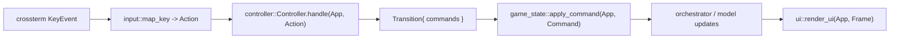
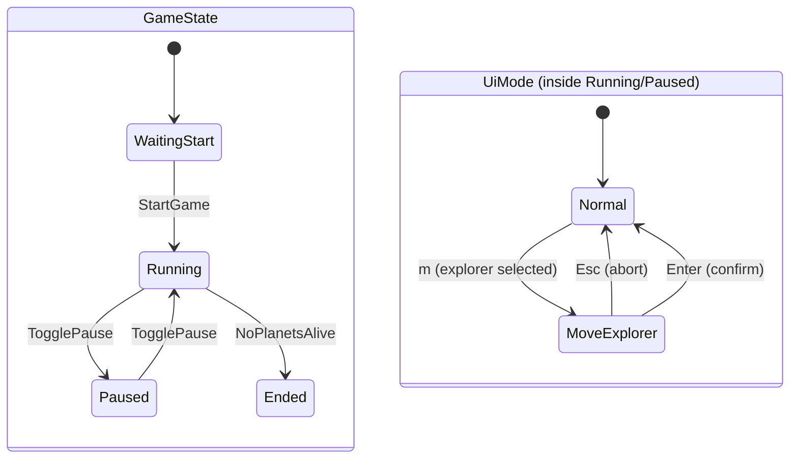

# ratatui-gui

Terminal UI for galaxy simulation (explorers + planets).

## Architecture overview

Goal: keep UI predictable and refactor-friendly by separating:

- **Model**: game data + orchestrator integration
- **Controller**: input-driven state machine + command emission
- **View**: ratatui rendering (no business logic)

This replaces earlier approach where:

- one giant key handler mixed navigation, phase changes, and orchestrator calls
- selection logic for multiple lists lived inside ad-hoc selector state
- UI render paths had to know too much about selection mechanics

## Data flow (one-frame)

Key idea: **Controller emits Commands**, game loop executes them. Render only reads state.

## Nested UI state machine

UI behavior is driven by nested state:

- `GameState` (screen/phase): `WaitingStart | Running | Paused | Ended`
- `UiMode` (interaction mode): `Normal | MoveExplorer{...}`
- `Focus` (routing for arrows in normal mode): `Planets | Explorers`

This prevents “giant match” growth by making each level responsible for one concern.

## Modules (what does what)

### Model (App)

File: `src/app.rs`

`App` owns:

- Orchestrator + latest snapshots (`planets_info`, `explorers_info`, `galaxy_topology`)
- Timers + queues for scheduled events
- UI state container `ui: AppUi`

Rule: **no direct key parsing inside `App`**.

### UI state (nested state)

File: `src/ui_state.rs`

`AppUi` owns UI-only state:

- `focus: Focus` (which list gets navigation)
- `mode: UiMode` (modal flows like MoveExplorer)
- `selectors: Selectors` (cursor state for tables)
- `start: StartScreenState` (start menu)
- `overlays: OverlayState` (log toggle + banner string)

Rule: UI state contains no orchestrator calls.

### Selectors (reusable cursor utilities)

File: `src/selector.rs`

`ListSelector` is a small reusable cursor:

- stores `TableState` for ratatui stateful widgets
- supports `move_up/move_down`, `clear`
- supports `restore_last` for focus switching behavior

`Selectors` groups per-list selectors (`planets`, `explorers`).

Rule: selectors do not know anything about “planet” or “explorer”.

### Input mapping (noise filter)

File: `src/input.rs`

`map_key(KeyEvent) -> Action`:

- filters non-press events
- maps raw keys into semantic `Action` values

Rule: controller works only with `Action`, not `KeyCode`.

### Controller (state machine)

File: `src/controller.rs`

`Controller::handle(app, action)`:

- dispatches by `GameState`, then `UiMode`, then `Focus`
- mutates `app.ui` (selectors, focus, mode, banner)
- returns `Transition { commands }`

Rule: controller does not call orchestrator directly.

### Commands (side effects)

File: `src/commands.rs`

`Command` represents “things to do” outside pure UI state:

- start/stop/restart
- toggle log overlay
- queue asteroid/sunray
- move explorer
- set game phase

### Command execution (bridge)

File: `src/game_state.rs`

`handle_game_state(app)`:

- reads one key event
- maps to `Action`
- runs controller
- applies emitted commands via `apply_command`

Rule: `apply_command` is where orchestrator gets called.

### View (render)

Files:

- `src/ui/mod.rs` entrypoint + theme creation
- `src/ui/main_screen/*` main in-game layout
- `src/ui/screens.rs` start screen
- `src/view_models.rs` pre-format view rows (keeps render dumb)
- `src/ui/theme/*` palette + intent styles + helpers

Rule: render code should not implement business decisions, only layout + styling.

## Extending behavior (example: new modal flow)

To add a new interaction (ex: “send explorer to planet” with extra confirmation):

1. Add a new `UiMode` variant in `src/ui_state.rs`
2. Add a handler in `src/controller.rs` for that mode
3. Emit a `Command` in `src/commands.rs`
4. Execute command in `apply_command` in `src/game_state.rs`
5. Render banner/prompt in UI (read from `app.ui.overlays.banner`)

Keeps nesting stable: `GameState -> UiMode -> Focus`.

